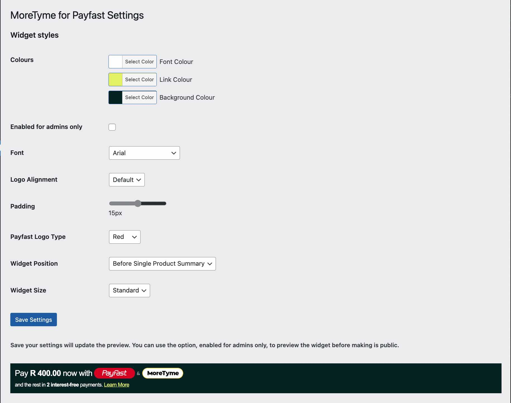
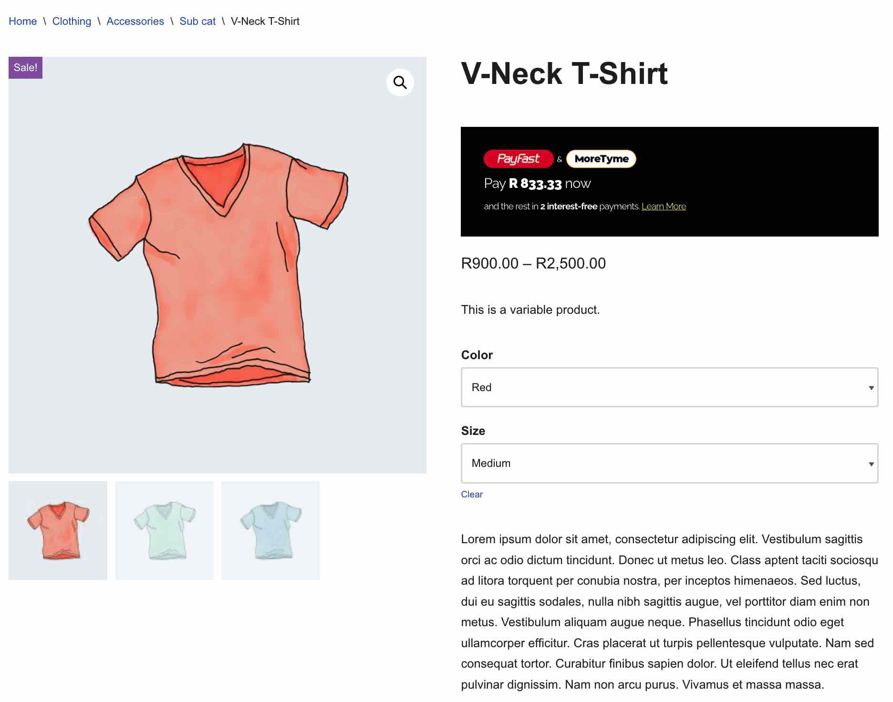

# MoreTyme Widget for Payfast
Boost sales on your website by implementing a personalised widget for your product pages. This widget will provide your customers with the amount they are required to pay upfront and for the next two payments with MoreTyme.

## What does this plugin do?
[The MoreTyme widget offered by Payfast](https://developers.payfast.co.za/docs#widgets-moretyme) is a widget that can be easily integrated into your online store. However, it does require some technical knowledge and assistance from a developer for the process. An alternative option is to use this plugin, which simplifies the implementation process and makes it easier for you to display the widget on your website without the need of support from a developer.

## Installing the plugin
If you are unsure on how to install a plugin please use the following [Step-by-step instructions](https://www.wpbeginner.com/beginners-guide/step-by-step-guide-to-install-a-wordpress-plugin-for-beginners/) from WP Beginner.

## Screenshots
#### Default Settings page.

#### Widget shown "Before Single Product Summary".

